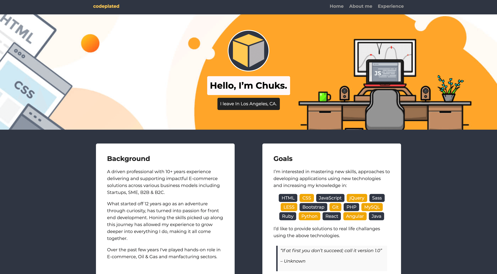

# FrontEnd Web Development Project 1

## Welcome! 👋

Thanks for checking out this front end web development Personal Profile Page project.

[Project 1 - Personal Profile ](https://techdegree-project-1.vercel.app/experience.html) challenges allow you to improve your skills in a real-life workflow.

**To do this challenge, you need a basic understanding of HTML, CSS and a tiny bit of JavaScript.**

## The challenge

For this project, I practiced web design skills by customizing a web page to create a personal profile. I modified the code for a basic web page by adding graphics, custom text, two extra web pages and a stylish design.

 This was a great way to practice HTML and CSS skills. It also gave me a web based platform to use as a personal online calling card to advertise my experience, skills, and goals, and to provide links to your social media accounts on Twitter, LinkedIn and GitHub.

## Advantage

I also practice using GitHub, an important tool used by millions of developers to share code and work collaboratively on programming projects. Creating and using a GitHub account is also a great way to share your work with potential employers.

## Challange Instructions

**Sections of this Guide:**
- How to approach this project includes detailed guidance to help you think about how
to organize your code, project and files.
- How to succeed at this project lists the grading requirements for the project, with hints,
links to course videos to refresh your memory and helpful resources.

## Download Or Clone

- Download the project source files from the project instructions page in your
Techdegree curriculum.

After downloading and unzipping, you should have the following files.
- index.html
- styles.css
- And an image folder containing:
- me.png
- portland.jpg
- and three social media icon SVGs.

## Deploying this project

This project is production ready and fully deployed 🚀 - [Here](https://techdegree-project-1.vercel.app/)

## To Do List

- [x] Download/clone the project source files from the project.
- [x] Create repo and initialize.
- [x] Create **About** and **experience** pages and link to **index**.
- [x] Upload all images.
- [x] Edit css file by adding relevant classes.
- [x] Use the Terminalad to add, commit and push all changes.
- [ ] Revisit project, update version 2.

